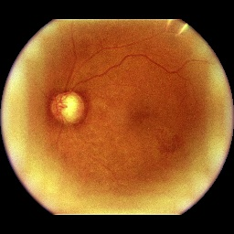
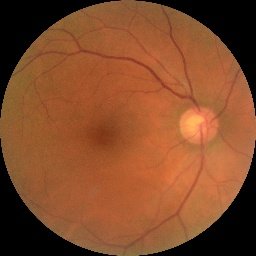

# GALURA - Galucoma Detection with Advanced Retinal Analysis

## Project Description
Glaura is an AI CNN model that can detect galucoma.........

## Contributor
| Full Name | Affiliation | Email | LinkedIn | Role |
|-----------|-------------|-------|----------|------|
| Muhamad Ridwan Firmansyah | Universitas Siliwangi | muhridwanf12@gmail.com | [link](https://www.linkedin.com/in/muhamad-ridwan-firmansyah-a922b5243/) | Team Lead |
| Rahmat Fauzi Prihastanto | Universitas Pamulang | zeekun0910@gmail.com | [link](https://www.linkedin.com/in/rahmat-fauzi-b555a11b2?utm_source=share&utm_campaign=share_via&utm_content=profile&utm_medium=android_app) | Team Member |
| Zakiy Qiros Muhammad | Universitas Negeri Surabaya | zakiyqm@gmail.com | [link](https://www.linkedin.com/in/zakiy-qiros-muhammad-255a46309/) | Team Member |
| Divo Kalama | Universitas Siber Asia | divoakademi@gmail.com | [link](https://www.linkedin.com/in/divokalama/) |Team Member |
| Fadhilah Ishma Diyanah | Universitas Sebelas Maret | fadhilahishma19@gmail.com | [link](https://www.linkedin.com/in/fadhilahishma/) | Team Member |
| Aditia Prathama | PT. Pama Persada Nusantara, Politeknik Negeri Sriwijaya | aditiaprathama01576@gmail.com | - | Team Member |
| Nicholas Dominic | Startup Campus, AI Track | nic.dominic@icloud.com | [link](https://linkedin.com/in/nicholas-dominic) | Supervisor |

## Setup
### Prerequisite Packages (Dependencies)
- pandas==2.1.0
- PIL==11.0.0
- tensorflow==2.17.1

### Environment
Glaura was trained using Google Colab with detailed specifications as follows
| | |
| --- | --- |
| GPU | Nvidia T4 (x1) |
| ROM | 112.6 GB (Available Disk) |
| RAM | 15 GB |

## Dataset
This is an improved machine-learning-ready glaucoma dataset using a balanced subset of standardized fundus images from the Rotterdam EyePACS AIROGS set. This dataset is split into training, validation, and test folders which contain 4000 (~84%), 385 (~8%), and 385 (~8%) fundus images in each class respectively. Each training set has a folder for each class: referable glaucoma (RG) and non-referable glaucoma (NRG).
<table>
  <tr>
    <td style="text-align: center;">
      
      <p><strong>RG (Referable Glaucoma)</strong></p>
    </td>
    <td style="text-align: center;">
      
      <p><strong>NRG (Non-Referable Glaucoma)</strong></p>
    </td>
  </tr>
</table>


- Link: [Click here](https://www.kaggle.com/datasets/deathtrooper/glaucoma-dataset-eyepacs-airogs-light-v2)

## Results
### Model Performance

#### 1. Metrics
Accuracy, precision, f1 score, and recall metrics are used as model benchmarks. For comparison, several models were also created.

| Model | Accuracy | Precision | Recal | F1 Score| Note |
| ----- | -------- | --------- | ----- | ------- | ---- |
| DenseNet169 | 92.5% | 89.2% | 96.8% | 92.9% | with augmentation (rotation between -20 until 20 deg, horizontal flip) |
| DenseNet121 | 93.3% | 93.9% | 92.7% | 93.3% | with augmentation (rotation between -20 until 20 deg, horizontal flip) |
| ResNet50 | 93.38% | 91.3% | 95.8% | 93.5% | with augmentation (rotation between -20 until 20 deg, horizontal flip) |
| Glaura | 94% | 89.8% | 93.3% | 91.5% | without augmentation |
| DenseNet169 | % | % | % | % | without augmentation |
| ResNet50 | % | % | % | % | without augmentation |


#### 2. Ablation Study
Any improvements or modifications of your base model, should be summarized in this table. Feel free to adjust the columns in the table below.

| model | layer_A | layer_B | layer_C | ... | top1_acc | top5_acc |
| --- | --- | --- | --- | --- | --- | --- |
| vit_b_16 | Conv(3x3, 64) x2 | Conv(3x3, 512) x3 | Conv(1x1, 2048) x3 | ... | 77.43% | 80.08% |
| vit_b_16 | Conv(3x3, 32) x3 | Conv(3x3, 128) x3 | Conv(1x1, 1028) x2 | ... | 72.11% | 76.84% |
| ... | ... | ... | ... | ... | ... | ... |

#### 3. Training/Validation Curve
Insert an image regarding your training and evaluation performances (especially their losses). The aim is to assess whether your model is fit, overfit, or underfit.
 
### Testing
Show some implementations (demos) of this model. Show **at least 10 images** of how your model performs on the testing data.

### Deployment (Optional)
Describe and show how you deploy this project (e.g., using Streamlit or Flask), if any.

## Supporting Documents
### Presentation Deck
- Link: https://...

### Business Model Canvas
Provide a screenshot of your Business Model Canvas (BMC). Give some explanations, if necessary.

### Short Video
Provide a link to your short video, that should includes the project background and how it works.
- Link: https://...

## References
Provide all links that support this final project, i.e., papers, GitHub repositories, websites, etc.
- Link: https://...
- Link: https://...
- Link: https://...

## Additional Comments
Provide your team's additional comments or final remarks for this project. For example,
1. ...
2. ...
3. ...

## How to Cite
If you find this project useful, we'd grateful if you cite this repository:
```
@article{
...
}
```

## License
For academic and non-commercial use only.

## Acknowledgement
This project entitled <b>"GALURA - Galucoma Detection with Advanced Retinal Analysis"</b> is supported and funded by Startup Campus Indonesia and Indonesian Ministry of Education and Culture through the "**Kampus Merdeka: Magang dan Studi Independen Bersertifikasi (MSIB)**" program.
