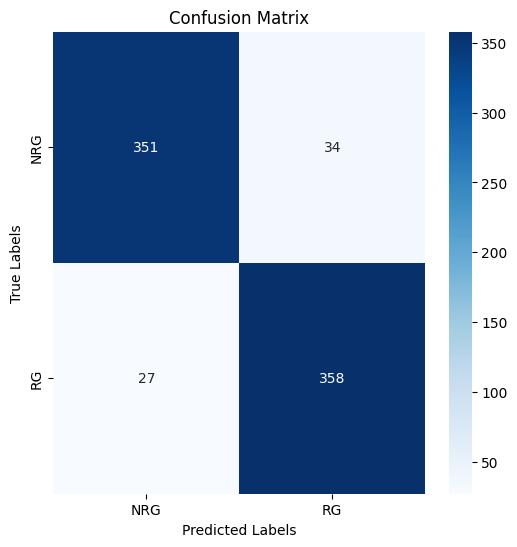
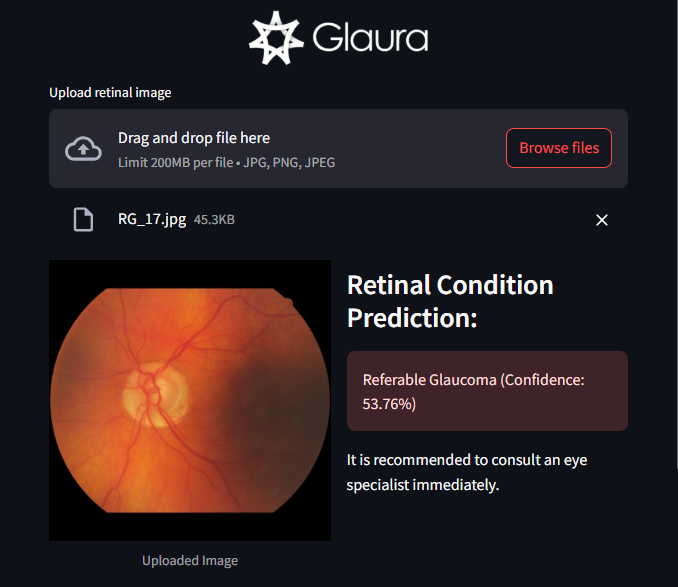

# GALURA - Glaucoma Detection with Advanced Retinal Analysis

## Project Description
Glaura is an advanced Artificial Intelligence (AI) model powered by Convolutional Neural Networks (CNN), specifically designed to identify and classify retinal images as either glaucomatous or healthy. By deep learning techniques, Glaura analyzes complex patterns and features within retinal scans that are often challenging for the human eye to discern.
This model is envisioned to serve as a reliable diagnostic tool for ophthalmologists, providing accurate and timely insights to support clinical decision-making. Its development focuses on enhancing early detection of glaucoma—a leading cause of irreversible blindness—thereby contributing to improved patient care and preventative eye health strategies.
With its robust architecture, Glaura represents a significant step forward in the integration of AI into the field of medical imaging and ophthalmology.

## Contributor
| Full Name | Affiliation | Email | LinkedIn | Role |
|-----------|-------------|-------|----------|------|
| Muhamad Ridwan Firmansyah | Universitas Siliwangi | muhridwanf12@gmail.com | [link](https://www.linkedin.com/in/muhamad-ridwan-firmansyah-a922b5243/) | Team Lead |
| Rahmat Fauzi Prihastanto | Universitas Pamulang | zeekun0910@gmail.com | [link](https://www.linkedin.com/in/rahmat-fauzi-b555a11b2?utm_source=share&utm_campaign=share_via&utm_content=profile&utm_medium=android_app) | Team Member |
| Zakiy Qiros Muhammad | Universitas Negeri Surabaya | zakiyqm@gmail.com | [link](https://www.linkedin.com/in/zakiy-qiros-muhammad-255a46309/) | Team Member |
| Divo Kalama | Universitas Siber Asia | divoakademi@gmail.com | [link](https://www.linkedin.com/in/divokalama/) |Team Member |
| Fadhilah Ishma Diyanah | Universitas Sebelas Maret | fadhilahishma19@gmail.com | [link](https://www.linkedin.com/in/fadhilahishma/) | Team Member |
| Aditia Prathama | PT. Pama Persada Nusantara, Politeknik Negeri Sriwijaya | aditiaprathama01576@gmail.com | - | Team Member |
| Nicholas Dominic | Startup Campus, AI Track | nic.dominic@icloud.com | [link](https://linkedin.com/in/nicholas-dominic) | Supervisor |

## Setup
### Prerequisite Packages (Dependencies)
- pandas==2.1.0
- PIL==11.0.0
- tensorflow==2.17.1
- matplotlib
- tensorflow-datasets
- numpy
- seaborn
- opencv-python


### Environment
Glaura was trained using Google Colab with detailed specifications as follows
| | |
| --- | --- |
| GPU | Nvidia T4 (x1) |
| ROM | 112.6 GB (Available Disk) |
| RAM | 15 GB |

## Dataset
This is an improved machine-learning-ready glaucoma dataset using a balanced subset of standardized fundus images from the Rotterdam EyePACS AIROGS set. This dataset is split into training, validation, and test folders which contain 4000 (~84%), 385 (~8%), and 385 (~8%) fundus images in each class respectively. Each training set has a folder for each class: referable glaucoma (RG) and non-referable glaucoma (NRG).

| **RG (Referable Glaucoma)** | **NRG (Non-Referable Glaucoma)** |
| --- | --- |
|       |        |


- Link: [Click here](https://www.kaggle.com/datasets/deathtrooper/glaucoma-dataset-eyepacs-airogs-light-v2)

## Results
### Model Performance

#### 1. Metrics
Accuracy, precision, f1 score, and recall metrics are used as model benchmarks. For comparison, several models were also created.

| Model | Accuracy | Precision | Recall | F1 Score| Note |
| ----- | -------- | --------- | ----- | ------- | ---- |
| DenseNet169 | 92% | 88.7% | 96.3% | 92.4% | with augmentation (rotation between -20 until 20 deg, horizontal flip) |
| DenseNet121 | 93.3% | 93.9% | 92.7% | 93.3% | with augmentation (rotation between -20 until 20 deg, horizontal flip) |
| ResNet50 | 93.3% | 91.3% | 95.8% | 93.5% | with augmentation (rotation between -20 until 20 deg, horizontal flip, noise) |
| Glaura | 89.8% | 89.8% | 89.8% | 89.8% | with augmentation (rotation between -20 until 20 deg, horizontal flip) |
| DenseNet169 | 93.8% | 91% | 97.4% | 94.1% | without augmentation |
| DenseNet121 | 93.8% | 91.4% | 96.8% | 94% | without augmentation |
| ResNet50 | 58% | 55% | 88% | 68% | without augmentation |
| Glaura | 93.4% | 91.4% | 95.8% | 93.5% | without augmentation |


#### 2. Ablation Study
Here are some experiments and hyperparameter tuning on the main model (Glaura)

| layer_A | layer_B | layer_C | layer_D | layer_E | Layer_F | Layer_G | layer_H | layer_I | layer_J | layer_K | layer_L | layer_M | layer_N | Precission | Recall | F1-Score | Accuracy |
| ------- | ------- | ------- | ------- | ------- | ------- | ------- | ------- | ------- | ------- | ------- | ------- | ------- | ------- | ------- | -------- | -------- | -------- |
| Conv2D(32, (3, 3)), BatchNorm, MaxPooling((2,2))  | Conv2D(64, (3, 3)), BatchNorm, MaxPooling((2,2))  | Conv2D(128, (3, 3)), BatchNorm, MaxPooling((2,2)) | Conv2D(256, (3, 3), BatchNorm, MaxPooling((2,2)) | Flatten | Dense(128), Dropout(0.5), BatchNorm | Dense(64), Dropout(0.5), BatchNorm | Dense(32), Dropout(0.5), BatchNorm | Dense(16), Dropout(0.5), BatchNorm | Dense(8), Dropout(0.5), BatchNorm | Dense(4), Dropout(0.5), BatchNorm | Dense(1) | - | - |  57.1% | 20.7% | 30.4% | 52.5% |
| Conv2D(64, (3, 3)), BatchNorm | Conv2D(32, (3, 3)), MaxPooling((2,2)) | Conv2D(128, (3, 3)), BatchNorm | Conv2D(128, (3, 3)), Dropout(0.3) | Conv2D(64, (3, 3)), BatchNorm | Conv2D(64, (3, 3)), Dropout(0.3) | Flatten | Dense(128), Dropout(0.5), BatchNorm | Dense(64), Dropout(0.5), BatchNorm | Dense(32), Dropout(0.5), BatchNorm | Dense(16), Dropout(0.5), BatchNorm | Dense(4) | Dense(1) | - | 71.4% | 1.2% | 2.5% | 50.3%|
| Conv2D(32, (3, 3)), MaxPooling((2,2)) | Conv2D(32, (3, 3)), BatchNorm | Conv2D(64, (3, 3)) | Conv2D(32, (3, 3)), MaxPooling((2,2)), BatchNorm | Conv2D(128, (3, 3)) | Conv2D(256, (3, 3)), MaxPooling((2,2)), BatchNorm | Flatten | Dense(128), Dropout(0.5), BatchNorm | Dense(64), Dropout(0.5), BatchNorm | Dense(32), Dropout(0.5), BatchNorm | Dense(16), Dropout(0.5), BatchNorm | Dense(8), Dropout(0.5), BatchNorm | Dense(4), Dropout(0.5), BatchNorm | Dense(1) | 58.1% | 39.7% | 47.2% | 55.5% |
| Conv2D(16, (3,3)), MaxPooling | Conv2D(32, (3,3)) | Conv2D(64, (3,3)) x2, MaxPooling | Flatten | Dense(256), BatchNorm | Dense(128), BatchNorm | Dense(64), BatchNorm | Dense(32), BatchNorm | Dense(166), BatchNorm | Dense(4), BatchNorm | Dense(1) | - | - | - | 76.3% | 82.3% | 79.2% | 78.4% |
| Conv2D(16, (3, 3)), MaxPooling((2,2)) | Conv2D(32, (3, 3)) | Conv2D(64, (3, 3)) x2, MaxPooling | Flatten | Dense(128), BatchNorm | Dense(64), BatchNorm | Dense(32), BatchNorm | Dense(16), BatchNorm | Dense(4), BatchNorm | Dense(1) | - | - | - | - | 82.8% | 76.3% | 79.4% | 80.2% |
| Conv2D(32, (3,3)), BatchNorm | Conv2D(128, (3,3)), BatchNorm, MaxPooling | Conv2D(64, (3,3)), BatchNorm | Conv2D(64, (3,3)), BatchNorm | Conv2D(256, (3,3)), BatchNorm, MaxPooling | Conv2D(128, (3,3)), BatchNorm | Conv2D(512, (3,3)), BatchNorm, GlobalAveragePooling | Flatten | Dense(256), Dropout(0.4) | Dense(128), Dropout(0.3) | Dense(64), Dropout(0.3) | Dense(1) | - | - | 90.9% | 90.6% | 90.7% | 90.7% |
| Conv2D(64, (3,3)), BatchNorm | Conv2D(64, (3,3)), BatchNorm, MaxPooling | Conv2D(128, (3,3)), BatchNorm | Conv2D(128, (3,3)), BatchNorm, MaxPooling | Conv2D(256, (3,3)), BatchNorm | Conv2D(256, (3,3)), BatchNorm, GlobalAveragePooling | Flatten | Dense(512), Dropout(0.4) | Dense(64), Dropout(0.3) | Dense(1) | - | - | - | - | 91.4% | 91.9% | 91.7% | 91.6% |
| Conv2D(64, (3,3)), BatchNorm | Conv2D(64, (3,3)), BatchNorm | Conv2D(256, (3,3)), BatchNorm, MaxPooling | Conv2D(128, (3,3)), BatchNorm | Conv2D(128, (3,3)), BatchNorm | Conv2D(512, (3,3)), BatchNorm, MaxPooling | Conv2D(256, (3,3)), BatchNorm | Conv2D(256, (3,3)), BatchNorm | Conv2D(1024, (3,3)), BatchNorm, MaxPooling | Conv2D(512, (3,3)), BatchNorm | Conv2D(512, (3,3)), BatchNorm | Conv2D(2048, (3,3)), BatchNorm, MaxPooling, GlobalAveragePooling | Dense(512), Dropout(0.4) | Dense(1) | 94.5% | 90.1% | 92.2% | 92.4% |
| Conv2D(64, (3,3)), BatchNorm | Conv2D(64, (3,3)), BatchNorm | Conv2D(256, (3,3)), BatchNorm, MaxPooling | Conv2D(128, (3,3)), BatchNorm | Conv2D(128, (3,3)), BatchNorm | Conv2D(512, (3,3)), BatchNorm, MaxPooling | Conv2D(256, (3,3)), BatchNorm | Conv2D(256, (3,3)), BatchNorm | Conv2D(1024, (3,3)), BatchNorm, MaxPooling | Flatten | Dense(512), Dropout(0.4) | Dense(128), Dropout(0.3) | Dense(32), Dropout(0.3) | Dense(1) | 93.4% | 91.4% | 95.8% | 93.5% |


#### 3. Training/Validation Curve
This is the final model's curve of Loss and Accuracy. The curve shows that train and validation is balance enough

 
### Testing


Classification Report:
|             | precision | recall | f1-score | support |
| ----------- | --------- | ------ | -------- | ------- |
|         NRG |      0.93 |   0.91 |    0.92  |     385 |
|         RG  |      0.91 |   0.93 |    0.92  |     385 |
|    accuracy |           |        |    0.92  |     770 |
|   macro avg |      0.92 |   0.92 |    0.92  |     770 |
|weighted avg |      0.92 |   0.92 |    0.92  |     770 |


To ensure model's performance, tests were conducted using 10 random new images that the model has never seen before
| Image | Lable | Predict |
| ----  | ----- | ------- |
| [NRG_1.jpg](Pictures/NRG_3.jpg) | NRG | NRG | 
| [NRG_2.jpg](Pictures/NRG_10.jpg) | NRG | NRG | 
| [NRG_3.jpg](Pictures/NRG_4.jpg) | NRG | NRG | 
| [NRG_4.jpg](Pictures/NRG_5.jpg) | NRG | NRG | 
| [NRG_5.jpg](Pictures/NRG_1.jpg) | NRG | NRG | 
| [RG_1.jpg](Pictures/RG_5.jpg) | RG | RG | 
| [RG_2.jpg](Pictures/RG_17.jpg) | RG | RG | 
| [RG_3.jpg](Pictures/RG_18.jpg) | RG | RG | 
| [RG_4.jpg](Pictures/RG_4.jpg) | RG | NRG | 
| [RG_5.jpg](Pictures/RG_1.jpg) | RG | RG |


### Deployment
Glaura was deployed on streamlit. Streamlit choosed because streamlit can provide an accessible and user-friendly web application. Through this deployment, users can upload retinal images directly to the platform, where Glaura processes and analyzes the images. Hosting on platforms like Streamlit Community Cloud or other cloud services ensures that the application is scalable and available to users anywhere, facilitating early detection and support for healthcare professionals.


<div style="display: flex; justify-content: center;">
  
  
</div>

## Supporting Documents
### Presentation Deck
- Link: https://...

### Business Model Canvas


### Short Video
Provide a link to your short video, that should includes the project background and how it works.
- Link: https://...

## References
Provide all links that support this final project, i.e., papers, GitHub repositories, websites, etc.
- Link: https://...
- Link: https://...
- Link: https://...

## Additional Comments
Provide your team's additional comments or final remarks for this project. For example,
1. ...
2. ...
3. ...

## How to Cite
If you find this project useful, we'd grateful if you cite this repository:
```
@article{
...
}
```

## License
For academic and non-commercial use only.

## Acknowledgement
This project entitled <b>"GALURA - Galucoma Detection with Advanced Retinal Analysis"</b> is supported and funded by Startup Campus Indonesia and Indonesian Ministry of Education and Culture through the "**Kampus Merdeka: Magang dan Studi Independen Bersertifikasi (MSIB)**" program.
